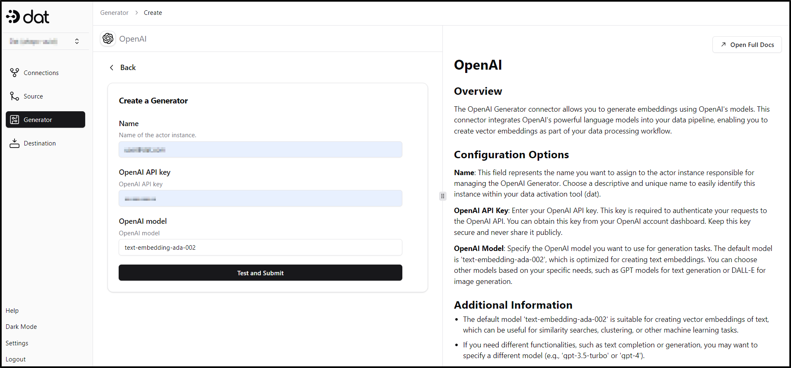

# Setting up a Generator

1. Go to the ‘Generator’ tab on the sidebar.
2. Click on ‘Create Generator’ to add the desired embeddings generating model.

<figure><figcaption></figcaption></figure>

3. Search and select the required generator from the list of Verified generators.

<figure><figcaption></figcaption></figure>

4. Fill in the configuration fields as per your requirements. For detailed instructions about each field you can view the detailed documentation of the particular generator.

<figure><figcaption></figcaption></figure>

5. Once completed, click on ‘Test and Submit’
6. After successful creation of the generator, you will be redirected to the list of generators where you can view your newly added generator.

<figure><figcaption></figcaption></figure>
