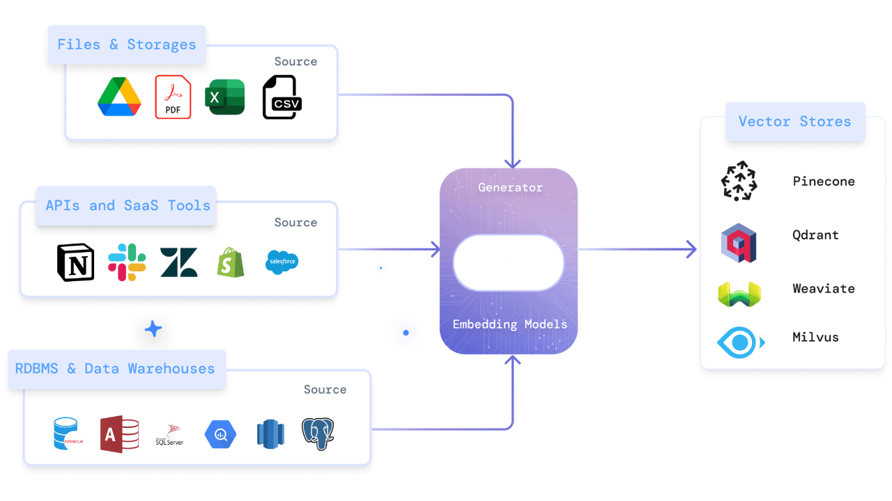

# About dat

### What is dat (data activation tool)?

Moving generative AI applications to production often requires using Vector stores to provide them with relevant context. Keeping these vector stores up-to-date with changes in your data is critical for the continued performance of these applications. dat makes this possible by setting up pipelines to update your vector stores as your source data changes.

